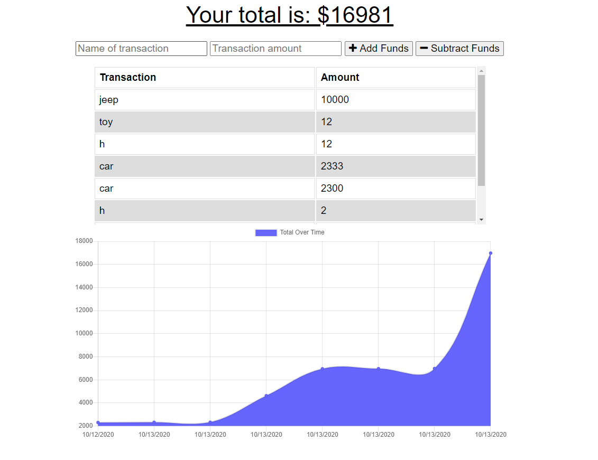

# Budget-Tracker

- [Description](#Description)
- [Installation](#Installation)
- [License](#License)
- [Developer](#Developer)
- [Questions](#Questions)
- [Visual](#Visual)

## Description
A budget app used to track your spending. 

## Installation
Must have node, mongodb, express, mongoose. 

## Usage
You can use it to keep track of your budget. You can add and subtract from your total budegt offline or online. 

## License

## Developer
Henry

## Questions
[Github Profile](https://github.com/HenryP23)  
You can contact me through my email henryhparrish@gmail.com

## Visual

